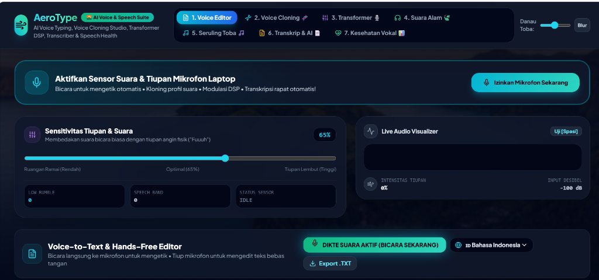

# AeroType 💨⚡ - AI Voice Cloning, Speech Transformer, Transcriber & Accessibility Suite (Danau Toba Edition 🌊)



AeroType adalah suite aplikasi web aksesibilitas dan kecerdasan buatan vokal komprehensif yang mengombinasikan **Speech-to-Text (Voice Dictation)**, **AI Voice Cloning & Neural Formant Profiling**, **Real-Time Voice Transformer DSP**, **Audio Transcriber & Meeting Summarizer**, **Vocal Health & Speech Therapy Monitor**, dan **Sensor Tiupan Fisik Mikrofon (*Physical Breath DSP Engine*)**. 100% berjalan di laptop tanpa smartphone dan tanpa kamera.

---

## 🌟 7 Multi-Mode Dashboard (100% Utilitas & Produktivitas)

### 1. 📝 Mode 1: Voice Dictation & Hands-Free Editor
- **Speech-to-Text (Voice Typing)**: Bicara langsung ke mikrofon; suara otomatis diubah menjadi teks secara real-time.
- **🎙️ Smart Voice AI Shortcuts**: Mengenali perintah suara otomatis saat mendikte:
  - *"paragraf baru"* / *"baris baru"* ➔ Enter otomatis
  - *"hapus semua"* / *"bersihkan teks"* ➔ Reset seluruh isi dokumen
  - *"buka kloning"*, *"buka transformer"*, *"buka transkrip"*, *"buka kesehatan vokal"*, *"buka suara alam"*, *"buka seruling"* ➔ Pindah tab mode secara hands-free!
- **Aksi Tiupan Bebas Tangan (Hands-Free)**: Toggle Dikte, Backspace, Space, Newline, Clear All.
- **WPM Counter** & Export `.txt`.

### 2. 🧬 Mode 2: AI Voice Cloning & Timbre Profile Studio ⭐
- **Kalibrasi Sampel Vokal (3 Langkah)**: Merekam sampel pengucapan alami pengguna untuk mengekstraksi frekuensi dasar (*Base Pitch F0*), resonansi *formant*, dan estimasi *timbre*.
- **Manajemen Profil Suara Kustom**: Menyimpan dan mengelola profil suara kustom (*Simpan/Hapus Profil Suara*) di browser.
- **Neural Text-to-Speech Synthesizer**: Mengetik naskah apa saja dan menyintesiskan ucapan dengan karakteristik pitch, kecepatan, dan resonansi vokal kloning Anda.
- **Ekspor Naskah & Audio**: Unduh naskah dan hasil rekaman suara.

### 3. 🎙️ Mode 3: Real-Time Voice Transformer & Studio DSP
- **Pemrosesan Suara Real-Time**: Memproses suara input mikrofon melalui rantai filter parametrik audio Web Audio API secara instan.
- **5 Preset Efek Suara Studio**:
  - 🎙️ *Studio Clarity*: Menghilangkan frekuensi gemuruh rendah dan meningkatkan kejelasan artikulasi vokal.
  - 📻 *Deep Broadcaster*: Menebalkan frekuensi rendah untuk resonansi suara penyiar podcast maskulin.
  - 🌊 *Danau Toba Cave Reverb*: Simulasi efek gema akustik tebing kaldera Danau Toba yang megah dan luas.
  - 🤖 *Cyber Vocoder & Robot*: Modulasi frekuensi suara sintetis karakter AI futuristik.
  - ✨ *Bright & Sweet*: Menaikkan nada vokal dan formant atas untuk artikulasi yang renyah.
- **Live FFT Spectrum Visualizer & Monitor Headset**: Pantau spektrum frekuensi vokal secara langsung dan dengarkan feedback suara termodulasi di headphone.

### 4. 🍃 Mode 4: Danau Toba Nature Sound & Focus Therapy Studio
- Generator audio ambien alam sintetis Web Audio API:
  - 🌊 **Ombak Danau Toba**: Deburan riak air danau vulkanik penenang pikiran.
  - 🌧️ **Hujan Tropis Samosir**: Suara rintik hujan untuk konsentrasi belajar dan bekerja.
  - 🌲 **Angin Hutan Pinus**: Desiran angin sejuk pegunungan untuk meditasi dan tidur lelap.

### 5. 🎵 Mode 5: Aero Flute (Seruling Digital Danau Toba)
- **Breath-Controlled Synthesizer**: Suara seruling sintetis (*Web Audio API*) yang berbunyi secara dinamis saat pengguna meniup mikrofon laptop.
- Dinamika volume & resonansi harmonik proporsional dengan kekuatan tiupan fisik.
- Skala Diatonik (Do-Re-Mi-Fa-Sol-La-Si-Do) dan Skala Etnik Gondang Batak Danau Toba.

### 6. 📄 Mode 6: Audio Transcriber & Meeting Summarizer
- **Transkripsi Percakapan Rapat Real-Time**: Mengubah pembicaraan rapat/wawancara menjadi linimasa teks berurutan lengkap dengan penanda waktu (*timestamp*) dan tag pembicara.
- **AI Auto-Summary Generator**: Menganalisis transkrip dan mengekstrak poin-poin intisari penting rapat secara otomatis.
- **Action Items & Checklist Extractor**: Menghasilkan daftar tindak lanjut tugas rapat yang dapat dicentang secara interaktif.
- **Ekspor Dokumen Markdown**: Ekspor naskah catatan rapat lengkap ke format `.md` atau salin langsung ke clipboard.

### 7. 📊 Mode 7: Vocal Bio-Feedback & Health Monitor
- **Live Pitch Detection (Autocorrelation)**: Deteksi frekuensi suara langsung dalam Hz dan notasi tangga nada musik (C2 hingga C5).
- **Vocal Strain & Jitter Health Gauge**: Pemantau kestabilan pita suara dan detektor kelelahan vokal (*Optimal / Mild Strain / High Fatigue*).
- **Decibel Safety Meter**: Pengukur batas intensitas desibel aman untuk menjaga kesehatan pendengaran.
- **Panduan Latihan Pemanasan Vokal**: Sesi latihan pemanasan pita suara 3-langkah (*Lip Trill/Humming, Siren Glide, Articulation Exercises*) dengan timer terpandu.

---

## 🎨 Tema Danau Toba HD
- Wallpaper panorama Danau Toba dengan perairan biru jernih dan perbukitan hijau Samosir.
- **Slider Opasitas & Blur**: Pengaturan transparansi latar belakang (10% - 85%) agar teks dan grafik data tetap terbaca dengan jelas.

---

## 🚀 Cara Menjalankan

### Opsi 1: Buka Langsung di Browser (Rekomendasi & Instan)
Buka berkas [**`index.html`**](file:///c:/Users/USER/.antigravity-ide/aerotype/index.html) di browser (Google Chrome / Microsoft Edge).
1. Klik tombol **"Izinkan Mikrofon Sekarang"**.
2. Nikmati seluruh 7 mode utilitas AI vokal!

### Opsi 2: Menjalankan via Next.js
```bash
cd c:\Users\USER\.antigravity-ide\aerotype
npm install
npm run dev
```
Buka `http://localhost:3000` di browser.

---

## 📁 Struktur Berkas

```
aerotype/
├── app/
│   ├── layout.tsx              # Root Layout
│   ├── globals.css             # Tema styling
│   └── page.tsx                # Dashboard 7-Mode Suite Danau Toba
├── components/
│   ├── AccessibilityEditor.tsx # Voice Typing + Smart Voice Commands
│   ├── VoiceCloningStudio.tsx  # AI Voice Cloning & Timbre Profile Studio
│   ├── VoiceTransformerStudio.tsx # Real-Time DSP Voice Transformer & EQ
│   ├── NatureSoundStudio.tsx   # Danau Toba Nature Soundscapes
│   ├── AeroFlute.tsx           # Breath Synthesizer Flute Instrument
│   ├── AudioTranscriberStudio.tsx # Audio Transcriber & Meeting Summarizer
│   ├── VocalHealthMonitor.tsx  # Vocal Bio-Feedback & Pitch Monitor
│   └── AudioVisualizer.tsx     # Live Spectrum & Decibel Meter
├── lib/
│   └── audio-blow-detector.ts  # Web Audio API Blowing DSP Algorithm
├── types/
│   └── index.ts                # TypeScript Type Definitions
├── danau_toba_bg.jpg           # Background Panorama Danau Toba HD
├── index.html                  # Standalone 7-Mode Zero-Dependency File
├── package.json
└── README.md
```
